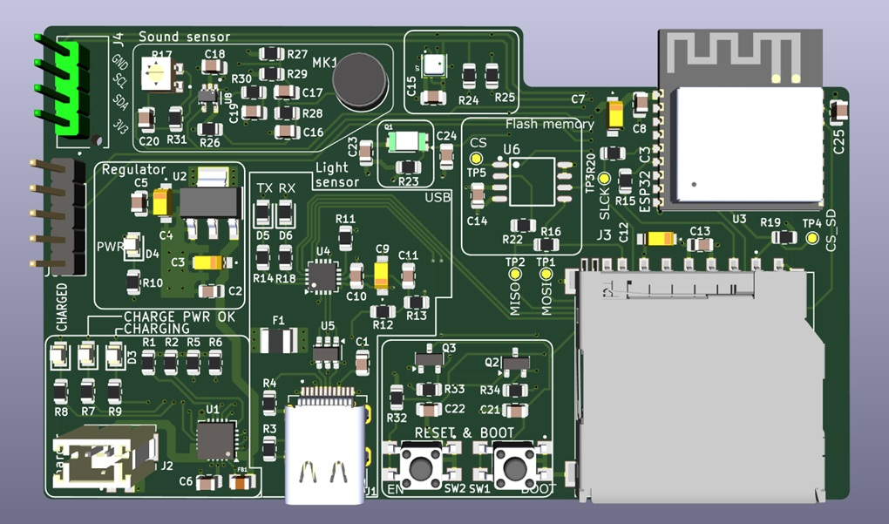
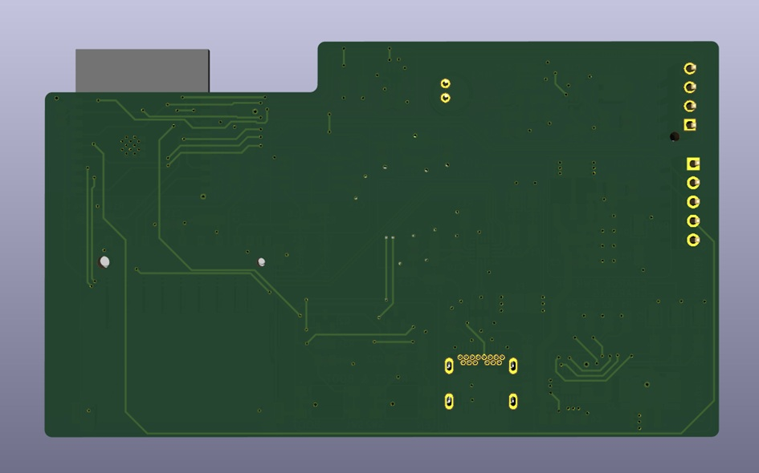

# CortexSense C3

A compact and intelligent 4-layer IoT development board powered by the ESP32-C3, designed for wireless sensing, environmental monitoring, AI-enabled edge applications, and rapid prototyping.

---

# Why the Name "CortexSense C3"?

The name **CortexSense C3** reflects the core philosophy of the board:

- **Cortex** represents intelligence, processing, and AI-driven capabilities.
- **Sense** highlights the board’s onboard sensing features such as environmental monitoring, ambient light detection, and audio input.
- **C3** refers to the ESP32-C3 microcontroller at the heart of the system.

Together, the name symbolizes an intelligent sensing platform capable of collecting, analyzing, and communicating real-world data.

---

# Overview

CortexSense C3 is a feature-rich embedded development platform combining wireless connectivity, onboard sensors, storage, battery support, and AI integration possibilities into a single compact PCB.

The board is built using a **4-layer PCB architecture** for improved signal integrity, grounding, and power distribution, making it suitable for reliable embedded and IoT applications.

This platform is ideal for:

- Environmental monitoring systems
- Wireless IoT nodes
- Portable data loggers
- AI-assisted embedded systems
- Voice-enabled smart devices
- Battery-powered sensing platforms
- Rapid embedded prototyping

---

# Hardware Features

## Microcontroller

### ESP32-C3
- RISC-V based architecture
- Wi-Fi connectivity
- Bluetooth Low Energy (BLE)
- USB support
- Low power operation
- Suitable for IoT and edge computing applications

---

# Power System

- USB-C power input
- LiPo battery connector
- Onboard 3.3V regulator
- Onboard 5V regulation circuitry
- Battery-powered operation support
- Power management circuitry

Designed for both:
- Portable battery-powered applications
- USB-powered desktop operation

---

# Storage

## MicroSD Card Slot
Supports:
- Sensor data logging
- Offline storage
- Audio recording
- Dataset collection

## External SPI Flash Memory
Useful for:
- Firmware storage
- Local caching
- AI model storage
- Configuration storage

---

# Sensors

## Environmental Sensor — BME280
Measures:
- Temperature
- Humidity
- Atmospheric pressure

Suitable for:
- Weather monitoring
- Indoor air analysis
- Smart agriculture
- Climate tracking

---

## Ambient Light Sensor
Features:
- Light intensity sensing
- Day/night detection
- Automatic brightness applications

---

## Audio Input System
Includes:
- Onboard microphone
- Audio pre-amplifier circuitry

Applications:
- Sound level monitoring
- Voice-controlled systems
- Acoustic analysis
- Smart assistants

---

# Interfaces

- I2C interface
- SPI interface
- GPIO expansion header
- USB-to-UART bridge
- Debug test points

Allows easy integration with:
- Displays
- External sensors
- Actuators
- Wireless modules
- Custom peripherals

---

# User Interaction

- Boot button
- Reset button
- Status LEDs
- GPIO headers

---

# PCB Design

## 4-Layer PCB Architecture

The board uses a professionally designed 4-layer PCB stackup for:

- Improved signal integrity
- Better grounding
- Reduced EMI
- Cleaner power distribution
- Compact routing

Additional design features:
- Dedicated debugging test points
- Optimized component placement
- Modular expansion capability

---

# Potential Applications

## Environmental Monitoring Station

CortexSense C3 can function as a compact weather and environmental monitoring system capable of tracking:

- Temperature
- Humidity
- Pressure
- Ambient light levels

Features include:
- Local logging to microSD
- Wireless cloud upload via Wi-Fi
- Remote monitoring dashboards
- Historical data storage

---

## Portable Data Logger

With battery support and onboard storage, the board is ideal for:

- Field research
- Agricultural monitoring
- Industrial sensing
- Mobile data collection

---

## Smart IoT Devices

The ESP32-C3 enables wireless communication for:

- Smart home systems
- Wireless sensor nodes
- BLE devices
- Remote monitoring applications

---

## Acoustic Monitoring

The onboard microphone system enables:

- Noise pollution monitoring
- Audio event detection
- Voice-triggered systems
- Environmental acoustic analysis

---

## Wearable Electronics

Its compact form factor and LiPo battery support make it suitable for:

- Wearable sensors
- Portable health devices
- Smart badges
- Mobile embedded systems

---

# AI and OpenAI Integration

One of the most exciting exploration areas for CortexSense C3 is embedded Artificial Intelligence.

Espressif provides OpenAI-compatible libraries and components for ESP32 platforms, enabling embedded devices to interact with Large Language Models (LLMs).

This opens the door to intelligent embedded applications capable of understanding and responding naturally.

---

# Voice-Controlled Smart Assistant

Using:
- The onboard microphone
- Wi-Fi connectivity
- OpenAI APIs

CortexSense C3 can become a conversational embedded assistant capable of:

- Understanding natural language
- Responding contextually
- Controlling smart devices
- Providing intelligent sensor analysis

Example interactions:

> “What is the current room temperature?”

> “Why is the humidity unusually high today?”

> “Turn on the lights.”

---

# Intelligent Environmental Insights

Instead of simply displaying raw sensor values, AI integration can:

- Analyze environmental trends
- Detect anomalies
- Generate human-readable summaries
- Recommend actions

Example:

> “Temperature has increased steadily for the last 3 hours. Consider watering the plants.”

---

# Future Improvements

Planned enhancements include:

- TinyML support
- Edge AI inference
- OTA firmware updates
- Display integration
- Additional sensor modules
- Ultra low-power optimization
- Custom enclosure development

---

# Software Support

CortexSense C3 can be programmed using:

- Arduino IDE
- ESP-IDF
- PlatformIO

---

# Recommended Libraries

## Connectivity
- WiFi
- BLE

## Storage
- SD card libraries
- SPIFFS

## Sensors
- BME280 drivers
- I2C utilities

## AI
- OpenAI ESP32 libraries

---

# Project Goals

The objective of CortexSense C3 is to create a flexible and expandable embedded platform for:

- IoT experimentation
- Wireless sensing
- Edge AI applications
- Embedded system learning
- Portable electronics development
- Rapid prototyping

---

# Getting Started

## Requirements

- USB-C cable
- ESP32 board support package
- Arduino IDE / ESP-IDF / PlatformIO
- Required sensor libraries

---

# Basic Workflow

1. Connect the board using USB-C
2. Install ESP32 board packages
3. Open the firmware project
4. Select the correct COM port
5. Build and flash firmware
6. Monitor serial output

---

# Images

## Front View



---

## Back View



# License

This project is licensed under the MIT License.

```text
MIT License
```

---

# Acknowledgements

Special thanks to:

- Espressif Systems
- OpenAI
- Open-source embedded community

---

# Status

🚧 Under Active Development

Current Version:
```text
Rev A / v1.0
```

---
